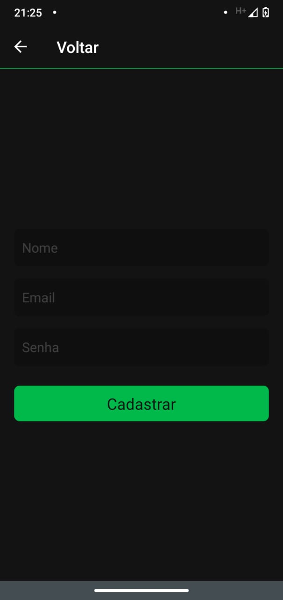
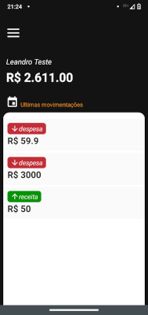
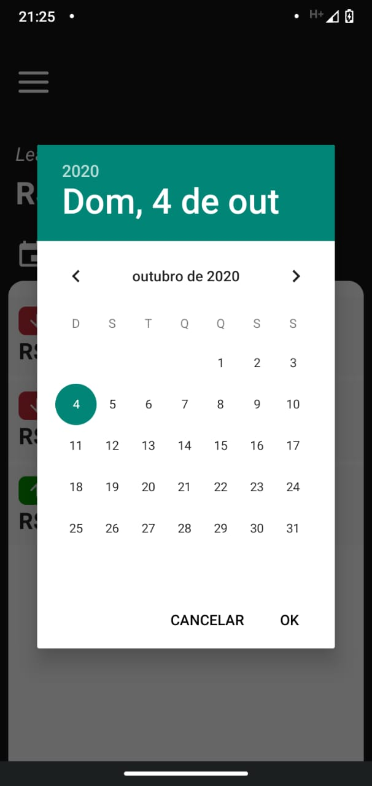
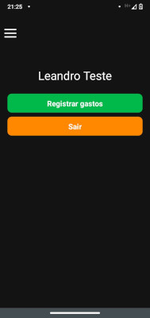
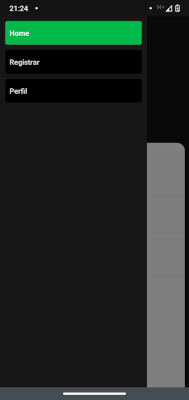
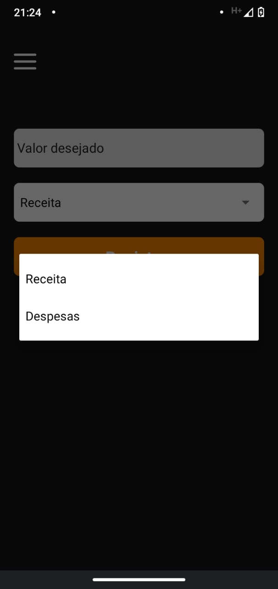
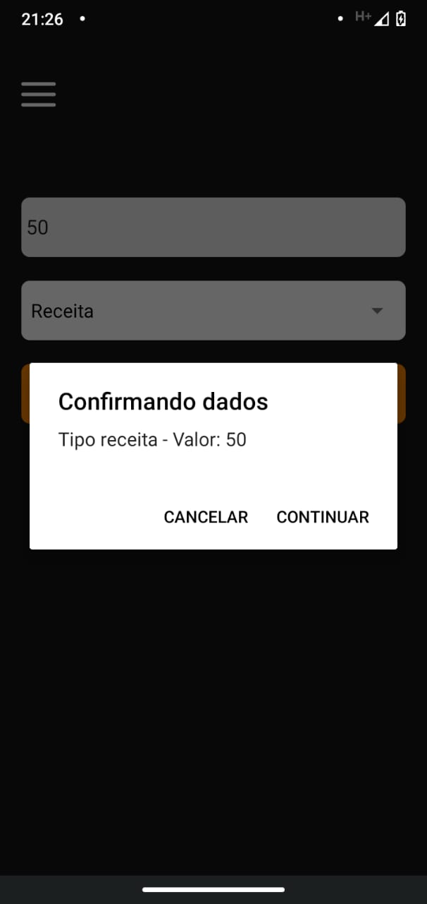

<h4 align="center">
 
 <b>BKO Finanças</b> 
</h4>

  
  
  
  
  
  
  
  

  

## Objetivo

Criar um App para me auxiliar nas finanças do dia-a-dia

## Instalação

### Pré-requisitos

Antes de começar, você vai precisar ter instalado em sua máquina as seguintes ferramentas:

- <b>[Git](https://git-scm.com)</b>

- <b>[Node.js](https://nodejs.org/en/)</b>

E também será preciso um editor, eu utilizo o <b>[VSCode](https://code.visualstudio.com/)</b>

### Clonar este repositório:

`git clone https://github.com/leandross86/bkoFinancas-React-Native.git`

Depois disso acesse o diretório e instale as dependências executando o seguinte comando:

`cd diretório`

`yarn install # ou npm install`

Executando a aplicação
`npx react-native run-android`

ou 

`npx react-native run-ios`

## Como contribuir

- Fork esse repositório;
- Crie uma branch com a sua feature: `git checkout -b my-feature`
- Commit suas mudanças: `git commit -m 'feat: My new feature'`
- Push a sua branch: `git push origin my-feature`

Depois que o merge da sua pull request for feito, você pode deletar a sua branch.

## Licença

Esse projeto está sob a licença MIT. Veja o arquivo [LICENSE](LICENSE) para mais detalhes.

## 🤝 Créditos

[Sujeito Programador](https://sujeitoprogramador.com/)

Desenvolvido com ❤ por Leandro Souza